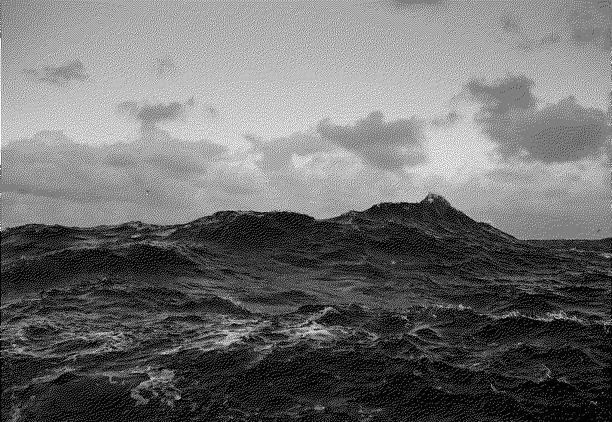

# qt-ditherer

## WhatIsIt
This qt-based app work with 32-bit RGB pics, makes'em 8-bit Indexed, downscales (hardcoded, but easy-rewriting) their color table and does dithering (Floyd-Steinberg algorythm).

### Before

### After

